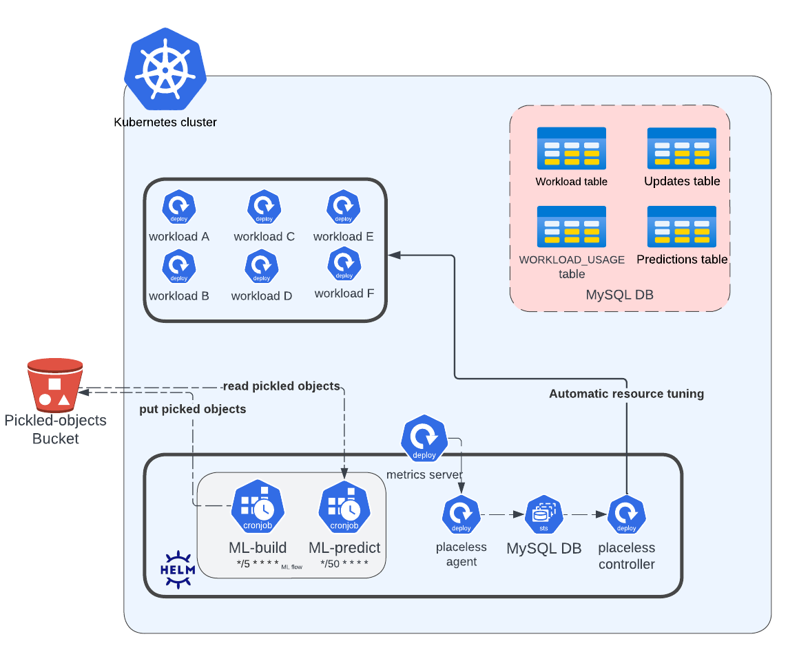

# PlaceLess Kubernetes Operator for Container Rightsizing

PlaceLess Kubernetes Operator is a machine learning driven operator for Kubernetes based container rightsizing.

The primary goal of PlaceLess is to optimize resource utilization and improve efficiency in K8s clusters. By analyzing historical usage data and utilizing our model, the application provides recommendations for resource limits and requests. Users can benefit from streamlined resource management and improved performance.

## Features
 The operator performs data analysis and provides resources configuration recommendations and allowing automatic configuration of Kubernetes resources. 

- Time-series modeling of Kubernetes deployments resource utilization 
- Based on the modeling PlaceLess provides resource requests and limits tuning recommendations
- (Optional) Automatic configuration of Kubernetes deployments resources requests and limits
- The PlaceLess UI visualize resource utilization, resource tuning recommendations and management of automatic actions.   

## Who should use PlaceLess?

Cluster administrators who wish to gain understanding into workload usage, using machine learning. 
The PlaceLess project aims to replace the tedious manual work of resources tuning involved in dynamic Kubernetes clusters.    

## Documentation

Quick Start Guide - TBD

## Installation

```
helm repo add k8s-resource-optimize public.ecr.aws/k6h2e2u3/k8s-resource-optimize:0.1.0
helm install k8s-resource-optimize
```

## How to Use the Project

1. Access the PlaceLess user interface.
2. Explore the resource insights provided by PlaceLess.
3. Implement the recommended resource limits and requests in your K8s configurations.
4. Optionally, toggle the manager permissions in the user interface to allow PlaceLess to manage your namespaces.
5. Monitor the impact of the recommended changes and make adjustments as needed.
```
Tips:
  - Take the time to thoroughly explore the recommendations and ensure they make sense before implementing them or enabling PlaceLess to apply them automatically.
  - Begin with auto-mode or recommendation implementation on less critical namespaces.
  - Periodically compare the resources allocated by PlaceLess with the actual usage when you enable PlaceLess auto-mode.
  ```

Please refer to the documentation for detailed guidelines, tips, and examples on using PlaceLess effectively.

## Architecture 



The PlaceLess system consists of the PlaceLess agent and controller, which are deployed on top of the user's cluster to provide resource monitor and adjustment capabilities using mutate and validation webhooks.

The system actively monitors all namespaces and workloads within the cluster to assess their resource utilization.

To gather and analyze cluster load data efficiently, the PlaceLess agent collecting every minute the data from the metrics server and then stored it in a MySQL database.

For optimized resource allocation, the system employs the ARIMA (Autoregressive Integrated Moving Average) model. This model is trained for each workload once a sufficient amount of data has been collected.

To anticipate future resource needs, the system triggers predictive analyses every 50 minutes for workloads with fitted ARIMA models. During each prediction, the system evaluates the necessity of modifying resource limits or requests. If changes are deemed beneficial, new recommendations are generated and stored in the Update table.

The controller actively queries the API to determine if there are any updates required for auto-managed workloads. If updates are necessary, the controller automatically applies the changes, ensuring the cluster operates at an optimal level.

The recommendations presented to the user interface are based on these regular predictions, with a safety interval incorporated to account for any unforeseen fluctuations or variations in resource demands. This ensures that the system provides reliable and proactive resource management for the cluster.


## Technical Overview and Technologies (move to docs and add link)

PlaceLess employs a set of technical approaches and utilizes various technologies to offer its functionality:

###### MySQL 

- PlaceLess utilizes MySQL to store both metadata and data related to the machine learning models it manages.
- During the installation of PlaceLess, the required MySQL database will be provisioned and configured automatically, streamlining the setup process.
- For a detailed view of the database schema, you can refer to the [schema documentation](https://github.com/placeless-com/placeless-helm-chart/blob/master/liquibase/src/master.xml). Any necessary changes to the schema can be performed using liquid-base and subsequently redeploying the helm chart.

###### S3 Bucket

- PlaceLess utilizes Amazon S3 bucket to store the machine learning models it manages.
- Upon installing PlaceLess, a dedicated S3 bucket will be assigned to facilitate efficient model storage and retrieval.

#### ETL (Extract, Transform, Load)

- PlaceLess implements a custom ETL process to handle data extraction, transformation, and loading.
- Data extraction is performed using Kube stats metrics, ensuring accurate and relevant data is collected.
- The transformation stage involves scaling units of measure and averaging samples within a minute for each workload independently.
- The final step is loading the transformed data into the Workload Usage table and Workload table, facilitating the recording of new workloads.

By employing these technologies and technical processes, PlaceLess delivers a robust and scalable solution for managing machine learning models and their associated data efficiently.


The selected technologies were chosen based on their suitability for handling Kubernetes, AWS integration and data analysis.

## Future Work 
See our [Roadmap](https://github.com/orgs/placeless-com/projects/1/views/1?layout=board)

## License

TBD - Specify the license under which the project is released.

## How to Contribute to the Project

You can contribute to the PlaceLess project by following these steps:

1. **Fork** the project repository on GitHub.
2. Make the desired changes or improvements in your forked repository.
3. Submit a **pull request (PR)** to the main project repository.
4. Provide a clear **description of the changes** and their purpose in the pull request.
5. Engage in discussions with the project maintainers and address any **feedback or suggestions** they may have regarding your contribution.
6. Collaborate with the community to **refine and finalize** the changes in the pull request.
7. Your contribution will be **reviewed** by the project maintainers, and upon acceptance, it will be **merged** into the main project.
8. Additionally, you can help improve the project by **reporting bugs** or any system misbehavior, including poor predictions, slow performance, out-of-sync issues, or any other observations that can assist us in identifying and addressing issues promptly.

We value and appreciate contributions from the community, and your efforts will help make PlaceLess a more robust and effective solution for managing machine learning models. Thank you for your interest in contributing to our open source project!

## Roadmap
See in the link [Placeless Roadmap](https://github.com/orgs/placeless-com/projects/1/views/1?layout=board)
